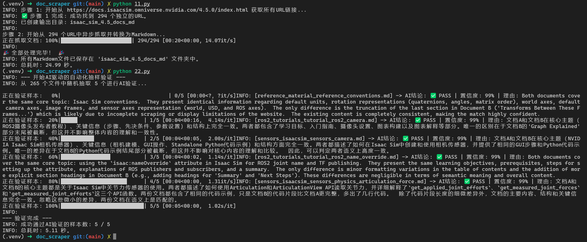
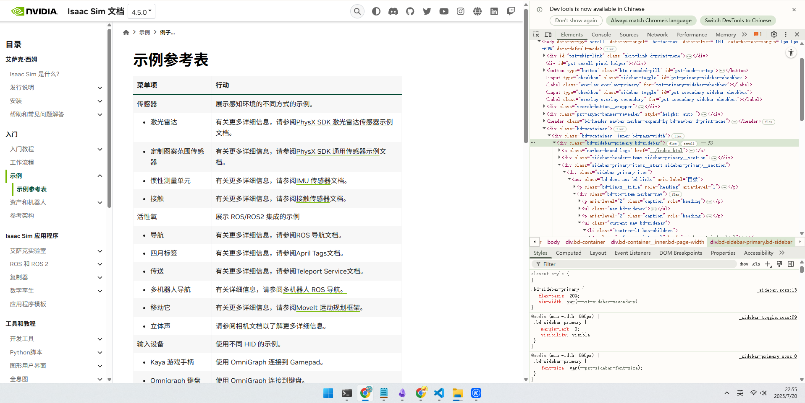
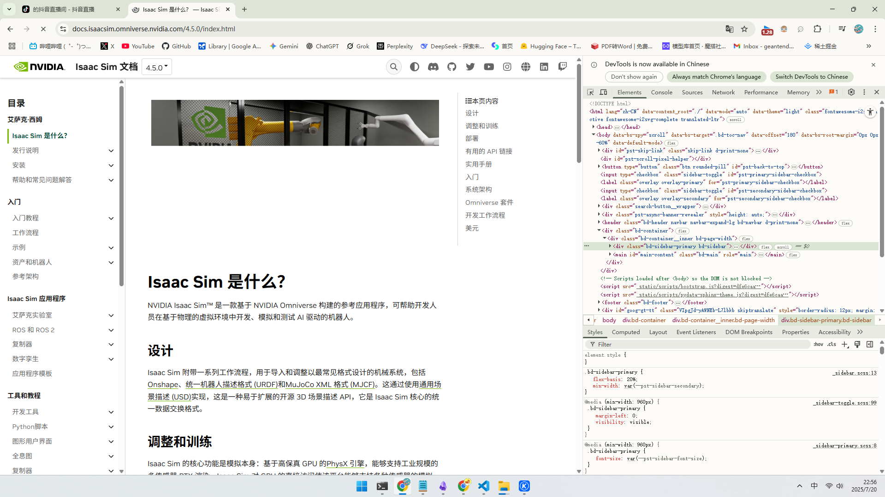

# AI-Doc-Scraper: AI驱动的官方文档知识库构建器

[](https://www.python.org/)
[](https://opensource.org/licenses/Apache-2.0)
[](./)

一个全自动的、由AI驱动的文档抓取与验证工具，让您能轻松地将任何官方文档网站，转化为您自己的、可靠的、可离线访问的本地Markdown知识库。

---

## 成果展示：100% 验证成功


> *上图为本项目成功抓取并验证NVIDIA Isaac Sim 4.5官方文档的最终结果。AI验证模块随机抽样5个文件，并以99%以上的置信度确认所有样本与官网内容语义一致。*

## 核心特性

-   🚀 **配置驱动**: 无需修改核心代码！只需一个简单的JSON文件（未来计划），即可适配任何新的文档网站。
-   🎯 **全自动抓取**: 自动从网站导航栏发现所有文档页面，清理无关元素，并将其转换为干净的Markdown格式。
-   🤖 **AI智能验证**: 利用大型语言模型（如Google Gemini），随机抽样并“阅读”抓取下来的文档，与实时官网内容进行语义比对，确保您的本地知识库100%可靠。
-   ⚡️ **异步高效**: 基于`aiohttp`和`asyncio`，实现高并发抓取，数分钟内即可完成数百个页面的处理。

## 为什么需要这个项目？

官方文档是学习新技术的最佳来源，但它们通常：
-   需要在线访问。
-   无法进行全局的、快速的本地全文搜索。
-   难以作为本地AI模型的知识库来源。

`AI-Doc-Scraper` 旨在解决这些痛点，为您打造一个私有的、高质量的、随时可用的技术知识库。

---

## 快速开始 (Quick Start)

1.  **克隆项目**
    ```bash
    git clone https://github.com/your-username/AI-Doc-Scraper.git
    cd AI-Doc-Scraper
    ```
2.  **创建环境并安装依赖**
    ```bash
    python3 -m venv .venv
    source .venv/bin/activate
    # --- 核心修正：使用正确的依赖文件 ---
    pip install -r requirements.in
    ```
3.  **配置API密钥**
    *   复制 `.env.example` 为 `.env`。
    *   在 `.env` 文件中，填入您的Google Gemini API密钥。
4.  **开始抓取！**
    ```bash
    # 步骤一：运行爬虫
    python 1_scrape_docs.py
    
    # 步骤二：运行AI验证
    python 2_validate_docs.py
    ```
    *脚本将自动抓取Isaac Sim 4.5文档，并在完成后进行AI抽样验证。*

---

## 如何适配一个新的网站？ (How to Adapt)

这是本项目的核心魅力所在。您只需要扮演“情报官”，AI就能为您完成所有技术工作。

<details>
<summary><strong>👉 点击展开：查看为AI准备“情报档案袋”的详细步骤</strong></summary>

**第一步：拍摄两张“情报照片”**

打开您想抓取的新网站，按`F12`打开“开发者工具”，然后拍摄以下两张截图：

1.  **“情报照片A”：导航栏的“身份证”**
    *   使用“箭头”工具，点击网站的**左侧导航栏**。截图整个浏览器窗口，确保右侧高亮的HTML代码清晰可见。
    *   **标准示例 (Isaac Sim 4.5)**:
        

2.  **“情报照片B”：正文内容的“身份证”**
    *   使用“箭头”工具，点击网站的**正文内容区域**。截图整个浏览器窗口。
    *   **标准示例 (Isaac Sim 4.5)**:
        

**第二步：使用“终极指令”模板**

将您的**黄金标准源码**（`1_scrape_docs.py`, `2_validate_docs.py`）和刚刚拍摄的两张**情报照片**，填入`AI辅助代码修改标准操作提示词(SOP).md`这个模板文件中，然后将完整的提示词交给AI即可。

</details>

## 未来计划 (Future Work)

`AI-Doc-scraper` 目录代表了本项目的未来演进方向。当前的核心功能由两个独立的脚本实现，这非常适合快速验证和教学。

---
</details>

## 未来计划 (Future Work)

`AI-Doc-scraper` 未来的计划是将这些功能重构为一个**统一的、模块化的、通过JSON配置驱动的命令行工具**，使其更易于集成和扩展。我不懂爬虫的基础知识，目前时间都在无人机自动追踪、配送方向；如果你是爬虫相关实践经验的爱好者，请一定联系我，我们一起研究学习开发AI爬虫，我可以自己培育模型进行数据识别编排，就不需要手动获取这些网站信息了。

---